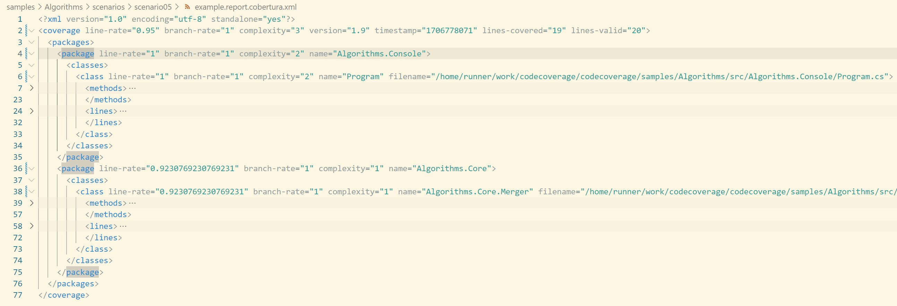

# Scenario Description

Collect code coverage using `dotnet-coverage` tool for Native AOT console application. 

> **_NOTE:_** `Microsoft.CodeCoverage.MSBuild` package needs to be added as reference of console application. Remember to re-publish your application without coverage instrumentation before deploying to production.

# Collect code coverage using command line

```shell
git clone https://github.com/microsoft/codecoverage.git
cd codecoverage/samples/Algorithms/src/Algorithms.Console/
dotnet publish -r win-x64 -c Release /p:AotMsCodeCoverageInstrumentation="true"
dotnet tool install -g dotnet-coverage
dotnet-coverage collect --output report.cobertura.xml --output-format cobertura bin/Release/net8.0/win-x64/publish/Algorithms.Console.exe
```

You can also use [run.ps1](run.ps1) to collect code coverage.

# Collect code coverage inside github workflow

`reportgenerator` can be used to generate final github summary markdown.

```yml
    steps:
    - uses: actions/checkout@v3
    - name: Setup .NET
      uses: actions/setup-dotnet@v3
      with:
        dotnet-version: 8.0.x
    - name: Publish
      run: dotnet publish -r linux-x64 -c Release /p:AotMsCodeCoverageInstrumentation="true"
    - name: Install dotnet-coverage
      run: dotnet tool install -g dotnet-coverage
    - name: Run
      run: dotnet-coverage collect --output $GITHUB_WORKSPACE/report.cobertura.xml --output-format cobertura ./bin/Release/net8.0/linux-x64/publish/Algorithms.Console
    - name: ReportGenerator
      uses: danielpalme/ReportGenerator-GitHub-Action@5.2.0
      with:
        reports: '${{ github.workspace }}/report.cobertura.xml'
        targetdir: '${{ github.workspace }}/coveragereport'
        reporttypes: 'MarkdownSummaryGithub'
    - name: Upload coverage into summary
      run: cat $GITHUB_WORKSPACE/coveragereport/SummaryGithub.md >> $GITHUB_STEP_SUMMARY
    - name: Archive code coverage results
      uses: actions/upload-artifact@v3
      with:
        name: code-coverage-report
        path: ${{ github.workspace }}/report.cobertura.xml
```

[Full source example](../../../../.github/workflows/Algorithms_Scenario05.yml)

[Run example](../../../../../../actions/workflows/Algorithms_Scenario05.yml)

# Collect code coverage inside Azure DevOps Pipelines

```yml
steps:
- task: DotNetCoreCLI@2
  inputs:
    command: 'publish'
    publishWebProjects: false
    zipAfterPublish: false
    arguments: '-r linux-x64 -c Release /p:AotMsCodeCoverageInstrumentation="true"'
    projects: '$(projectPath)' # this is specific to example - in most cases not needed
  displayName: 'publish'

- task: DotNetCoreCLI@2
  inputs:
    command: 'custom'
    custom: "tool"
    arguments: 'install -g dotnet-coverage'
  displayName: 'install dotnet-coverage'

- task: Bash@3
  inputs:
    targetType: 'inline'
    script: 'dotnet-coverage collect --output-format cobertura --output $(Agent.TempDirectory)/report.cobertura.xml ./samples/Algorithms/src/Algorithms.Console/bin/Release/net8.0/linux-x64/publish/Algorithms.Console'
  displayName: 'run'

- task: PublishCodeCoverageResults@2
  inputs:
    summaryFileLocation: $(Agent.TempDirectory)/**/*.cobertura.xml
```

[Full source example](azure-pipelines.yml)


# Report example



[Link](example.report.cobertura.xml)