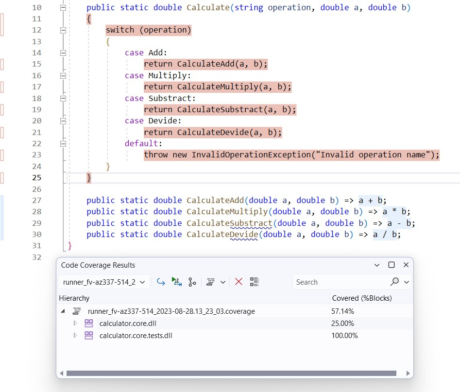

**Scenario Description**

Collect code coverage using default settings. Default format is binary (`.coverage` extension) which can be opened in Visual Studio Enterprise.

**Collect code coverage using command line**

```shell
git clone https://github.com/microsoft/codecoverage.git
cd codecoverage/samples/Calculator/tests/Calculator.Core.Tests/
dotnet test --collect "Code Coverage"
```

You can also use [run.ps1](run.ps1) to collect code coverage.

**Collect code coverage inside github workflow**

```shell
    steps:
    - uses: actions/checkout@v3
    - name: Setup .NET
      uses: actions/setup-dotnet@v3
      with:
        dotnet-version: 7.0.x
    - name: Restore dependencies
      run: dotnet restore
    - name: Build
      run: dotnet build --no-restore
    - name: Test
      run: dotnet test --collect "Code Coverage" --no-build --verbosity normal
    - name: Archive code coverage results
      uses: actions/upload-artifact@v3
      with:
        name: code-coverage-report
        path: ./**/TestResults/**/*.coverage
```

[Full source example](../../../../.github/workflows/Calculator_Scenario01.yml)

[Run example](../../../../../../actions/workflows/Calculator_Scenario01.yml)

**Collect code coverage inside Azure DevOps Pipelines**

```shell
steps:
- task: DotNetCoreCLI@2
  inputs:
    command: 'restore'
    projects: '$(projectPath)' # this is specific to example - in most cases not needed
  displayName: 'dotnet restore'

- task: DotNetCoreCLI@2
  inputs:
    command: 'build'
    arguments: '--no-restore --configuration $(buildConfiguration)'
    projects: '$(projectPath)' # this is specific to example - in most cases not needed
  displayName: 'dotnet build'

- task: DotNetCoreCLI@2
  inputs:
    command: 'test'
    arguments: '--no-build --configuration $(buildConfiguration) --collect "Code Coverage"'
    projects: '$(projectPath)' # this is specific to example - in most cases not needed
  displayName: 'dotnet test'
```

> **_NOTE:_** Azure DevOps pipelines automatically recognize binary coverage report format. Code coverage results are automatically processed and published to Azure DevOps. No additional steps needed.

[Full source example](azure-pipelines.yml)


**Report example**



[Link](example.report.coverage)