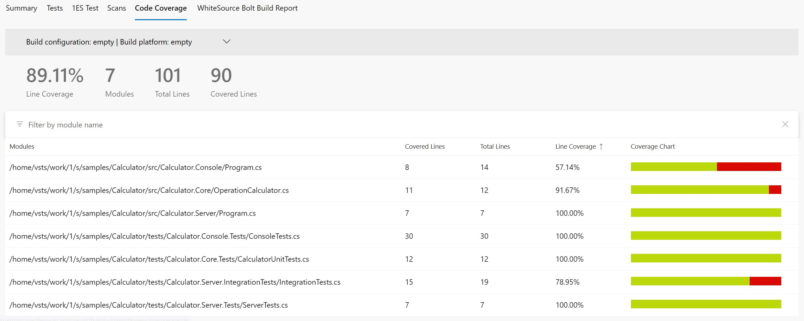

# Scenario Description

Collect code coverage for whole solution. In this example we show that if you have script to run all tests you can easily prepend it with `dotnet-coverage collect` to collec coverage for whole solution.

# Collect code coverage using command line

```shell
git clone https://github.com/microsoft/codecoverage.git
cd codecoverage/samples/Calculator
dotnet build
dotnet tool install -g dotnet-coverage
dotnet-coverage collect --output-format cobertura --output report.cobertura.xml "bash ./scenarios/scenario21/tests.sh"
```

# Collect code coverage inside github workflow

To generate summary report `.coverage` report needs to be converted to `cobertura` report using `dotnet-coverage` tool. Then `reportgenerator` can be used to generate final github summary markdown.

```yml
    steps:
    - uses: actions/checkout@v3
    - name: Setup .NET
      uses: actions/setup-dotnet@v3
      with:
        dotnet-version: 7.0.x
    - name: Restore dependencies
      run: dotnet restore
    - name: Build
      run: dotnet build --no-restore
    - name: Install dotnet-coverage
      run: dotnet tool install -g dotnet-coverage
    - name: Generate logs directory
      run: mkdir $LOGS_DIR
    - name: Start server
      run: dotnet-coverage collect --settings ./scenarios/scenario21/coverage.runsettings -l $LOGS_DIR/collect.log -ll Verbose --output report.coverage --session-id TagScenario21 "dotnet run --no-build" &
      working-directory: ./samples/Calculator/src/Calculator.Server
    - name: Run tests
      run: dotnet test --settings ./scenarios/scenario21/coverage.runsettings --no-build --verbosity normal --results-directory ./TestResults/ --diag $LOGS_DIR/log.txt
      working-directory: ./samples/Calculator
    - name: Stop server
      run: dotnet-coverage shutdown -l $LOGS_DIR/shutdown.log -ll Verbose TagScenario21
    - name: Merge coverage reports
      run: dotnet-coverage merge -l $LOGS_DIR/merge.log -ll Verbose -r -f cobertura -o $GITHUB_WORKSPACE/report.cobertura.xml "./TestResults/*.coverage" src/Calculator.Server/report.coverage
      working-directory: ./samples/Calculator
    - name: ReportGenerator
      uses: danielpalme/ReportGenerator-GitHub-Action@5.1.26
      with:
        reports: '${{ github.workspace }}/report.cobertura.xml'
        targetdir: '${{ github.workspace }}/coveragereport'
        reporttypes: 'MarkdownSummaryGithub'
    - name: Upload coverage into summary
      run: cat $GITHUB_WORKSPACE/coveragereport/SummaryGithub.md >> $GITHUB_STEP_SUMMARY
    - name: Archive code coverage results
      uses: actions/upload-artifact@v3
      with:
        name: code-coverage-report
        path: '${{ github.workspace }}/report.cobertura.xml'
    - name: Archive code coverage logs
      uses: actions/upload-artifact@v3
      with:
        name: code-coverage-logs
        path: '${{ github.workspace }}/logs/*'
```

[Full source example](../../../../.github/workflows/Calculator_Scenario21.yml)

[Run example](../../../../../../actions/workflows/Calculator_Scenario21.yml)

# Collect code coverage inside Azure DevOps Pipelines

```yml
steps:
- task: DotNetCoreCLI@2
  inputs:
    command: 'restore'
    projects: '$(solutionPath)' # this is specific to example - in most cases not needed
  displayName: 'dotnet restore'

- task: DotNetCoreCLI@2
  inputs:
    command: 'build'
    arguments: '--no-restore --configuration $(buildConfiguration)'
    projects: '$(solutionPath)' # this is specific to example - in most cases not needed
  displayName: 'dotnet build'

- task: DotNetCoreCLI@2
  inputs:
    command: 'custom'
    custom: "tool"
    arguments: 'install -g dotnet-coverage'
  displayName: 'install dotnet-coverage'

- task: Bash@3
  inputs:
    targetType: 'inline'
    script: 'mkdir $(Agent.TempDirectory)/logs'
  displayName: 'create logs directory'

- task: Bash@3
  inputs:
    targetType: 'inline'
    script: 'dotnet-coverage collect --settings samples/Calculator/scenarios/scenario21/coverage.runsettings -l $(Agent.TempDirectory)/logs/collect.log -ll Verbose --output $(Agent.TempDirectory)/server.coverage --session-id TagScenario21 "dotnet run --project $(projectPath) --no-build" &'
  displayName: 'start server under coverage'
  env:
    LOGS_DIR: '$(Agent.TempDirectory)/logs/'

- task: DotNetCoreCLI@2
  inputs:
    command: 'test'
    arguments: '--no-build --configuration $(buildConfiguration) --settings samples/Calculator/scenarios/scenario21/coverage.runsettings --logger trx --results-directory $(Agent.TempDirectory) --diag $(Agent.TempDirectory)/logs/log.txt'
    publishTestResults: false
    projects: '$(solutionPath)' # this is specific to example - in most cases not needed
  displayName: 'execute tests'
  env:
    LOGS_DIR: '$(Agent.TempDirectory)/logs/'

- task: Bash@3
  inputs:
    targetType: 'inline'
    script: 'dotnet-coverage shutdown -l $(Agent.TempDirectory)/logs/shutdown.log -ll Verbose TagScenario21'
  displayName: 'stop server'

- task: Bash@3
  inputs:
    targetType: 'inline'
    script: 'dotnet-coverage merge -l $(Agent.TempDirectory)/logs/merge.log -ll Verbose -f cobertura -o merged.cobertura.xml --recursive "*.coverage"'
    workingDirectory: "$(Agent.TempDirectory)"
  displayName: 'merge coverage results'

- task: PublishTestResults@2
  inputs:
    testResultsFormat: 'VSTest'
    testResultsFiles: '$(Agent.TempDirectory)/**/*.trx'
    publishRunAttachments: false

- task: PublishCodeCoverageResults@2
  inputs:
    summaryFileLocation: $(Agent.TempDirectory)/merged.cobertura.xml

- publish: $(Agent.TempDirectory)/logs
  artifact: logs
```

> **_NOTE:_** To make sure that Code Coverage tab will be visible in Azure DevOps you need to make sure that previous steps will not publish test attachments (`publishRunAttachments: false` and `publishTestResults: false`).

[Full source example](azure-pipelines.yml)



# Report example


[Link](example.report.cobertura.xml)